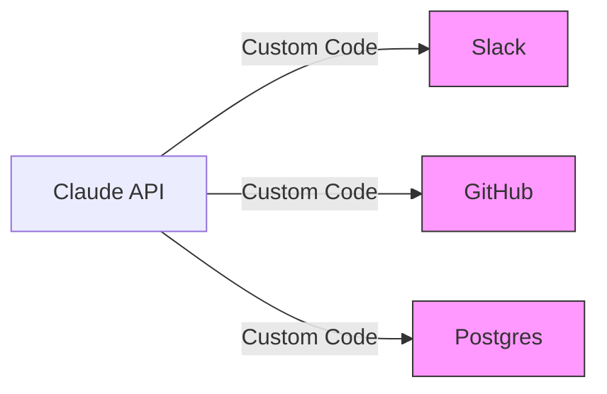
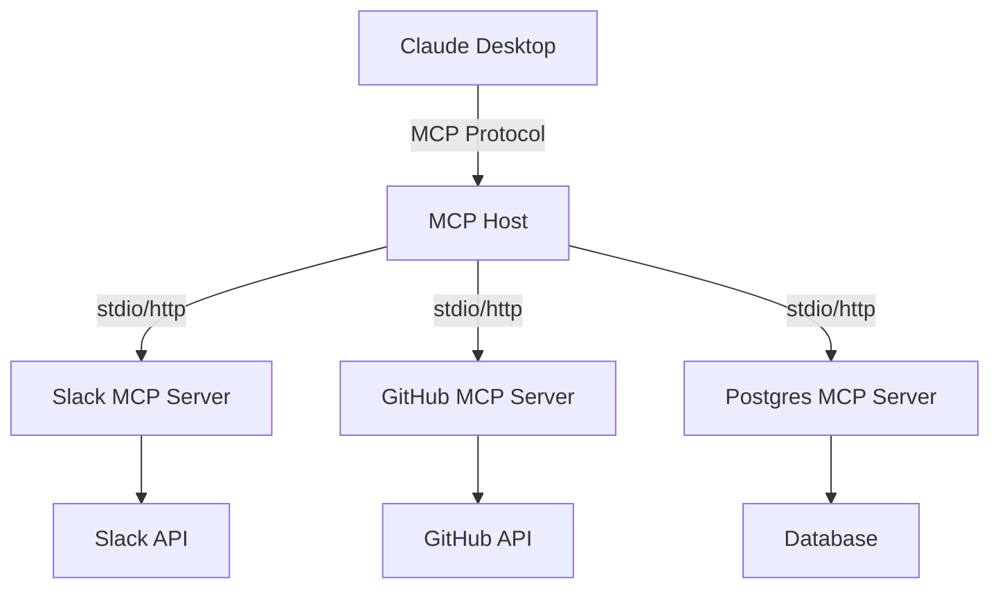

## 4.1 MCP 是什么：AI 世界的 USB-C

在 2024 年之前，如果想让 Claude 读取电脑上的文件，或者查询公司的数据库，需要编写大量的“胶水代码”。这就像是在不同品牌的手机充电器之间寻找转接头——繁琐、混乱且互不兼容。对于这样的问题，再加一层是计算机领域屡试不爽的办法。

**Model Context Protocol (MCP)** 的出现，彻底改变了这一切。Anthropic 将其发布为一种开放标准，并在开发者社区引发了轰动。

### 4.1.1 痛点：集成的“巴别塔”

在 MCP 诞生之前，将 LLM 连接到数据源面临着巨大的碎片化问题：

*   **重复造轮子**：每个开发者如果要连接 Google Drive，都得自己写一套 OAuth 认证、API 封装和数据清洗逻辑。
*   **维护噩梦**：一旦 Slack 更新了 API，所有连接 Slack 的 Agent 都得重写代码。
*   **上下文孤岛**：IDE 里的 AI 助手读不到浏览器里的内容，因为它们运行在不同的沙箱里。

这就像早期的计算机外设接口——鼠标用 PS/2，打印机用并口，显示器用 VGA。如果想换个设备，可能连接口都插不上。

### 4.1.2 解决方案：标准化的通用协议

MCP 的核心理念非常简单：**让 AI 连接数据就像插 USB 设备一样简单。**

它定义了一套通用的协议，规定了 AI 模型（Client）和数据源（Server）之间该如何“握手”和“对话”。

#### 这里的“USB-C”意味着什么？
1.  **标准化 (Standardized)**：无论你是连接本地文件系统、PostgreSQL 数据库还是 Notion 笔记，对于 Claude 来说，它们看起来都**一模一样**。Claude 只需要学会说“MCP 语言”。
2.  **即插即用 (Plug-and-Play)**：一旦安装了一个 MCP Server（比如 `mcp-server-github`），任何支持 MCP 的客户端（如 Claude Desktop App, Cursor, Zed）都能立即获得读取 GitHub 的能力，无需额外开发。
3.  **双向流通 (Bi-directional)**：不仅 Claude 可以读取数据（Context/上下文），它还可以执行操作（Tools/工具），甚至请求用户采样（Sampling）。

### 4.1.3 架构对比

#### 传统模式 (Ad-hoc Integration)

每个连接都需要独特的维护。

#### MCP 模式 (Standardized Protocol)

Claude 只需维护与 Host 的连接。具体的业务逻辑被封装在各个 Server 中。

### 4.1.4 为什么这对开发者很重要？

*   **对于工具开发者**：只需要写一次 `mcp-server`，工具就能被所有 AI 客户端（Claude, Cursor, VS Code...）直接使用。
*   **对于 AI 应用开发者**：可以专注于构建 Agent 的逻辑，而不用担心底层如何解析 PDF 或如何连接 MySQL。只需配置好现成的 MCP Server 即可。

### 4.1.5 MCP 的诞生

MCP 由 Anthropic 工程师 **David Soria Para** 和 **Justin Spahr-Summers** 创建。创意源于 David 在使用 Claude Desktop 时的一个痛点：需要不断在 Claude 和 IDE 之间复制粘贴代码。

这是一个典型的 **M×N 问题**：M 个 AI 应用需要连接 N 个外部服务，传统方式需要 M×N 个独立集成。MCP 的设计灵感来自 **Language Server Protocol (LSP)**—一个标准化的协议只需要 M+N 个实现即可完成全部连接。

2024 年 11 月，Anthropic 将 MCP 开源，使整个 AI 生态系统都能受益。

### 4.1.6 生态系统概览

MCP 生态正在快速扩张：

#### 客户端（MCP Client）
实现了 MCP Client 的应用可以连接任何 MCP Server：
- Claude Desktop App
- Claude Code
- Zed Editor
- Cursor
- VS Code 扩展

#### 服务端（MCP Server）

| 类别 | 示例 |
| :--- | :--- |
| 本地资源 | Filesystem, SQLite, Git |
| 云服务 | AWS, Google Drive, Azure |
| SaaS | Slack, Linear, Notion, Sentry |
| 浏览器 | Puppeteer (网页自动化) |

### 4.1.7 Connectors：零配置的 MCP 体验

对于非技术用户，Anthropic 在 Claude.ai 中提供了 **Connectors**—预封装的 MCP Server：

- **无需配置**：点击启用即可使用
- **官方合作**：由 Anthropic 与合作伙伴共同维护
- **权限管理**：细粒度的访问控制

#### 热门 Connectors

| Connector | 功能 |
| :--- | :--- |
| **Notion** | 读写 Notion 页面和数据库 |
| **Figma** | 访问设计稿，生成前端代码 |
| **Canva** | 在画布中生成设计 |
| **Linear** | 创建和更新工单 |
| **Stripe** | 查询支付数据 |
| **Hubspot** | 自动化 CRM 任务 |
| **Sentry** | 分析错误日志 |

启用方式：在 [Claude Directory](https://claude.com/directory) 中浏览可用 Connectors，点击添加即可。

---

现在理解了 MCP 作为"连接一切"的通用标准。接下来深入探讨其内部架构—Client 和 Server 之间到底发送了什么消息？

➡️ [深入 MCP 架构原理](4.2_architecture.md)
