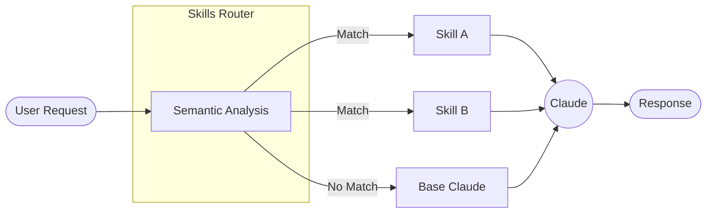

## 6.1 什么是 Claude Skills：模块化的专业能力扩展

在 2025 年 10 月，Anthropic 正式发布了 **Agent Skills** 功能。这标志着 Claude 从一个通用的对话助手，进化为可以被**定制化增强**的专业化平台。

### 6.1.1 官方定义

根据 Anthropic 官方博客的定义：

> **Skills are folders that include instructions, scripts, and resources that Claude can load when needed.**

翻译过来就是：**Skills 是包含指令、脚本和资源的文件夹，Claude 可以在需要时动态加载它们。**

这个定义揭示了 Skills 的三个核心特征：
1. **文件夹结构**：Skills 不是一段 Prompt 文本，而是一个工程化的目录。
2. **多类型资源**：可以包含 Markdown 指令、可执行脚本、参考文档等。
3. **按需加载**：Claude 会根据任务自动判断是否需要加载某个 Skill。

### 6.1.2 核心范式转变：从 Prompt Engineering 到 Context Engineering

Skills 的出现代表了一个更深层次的理念转变：**上下文工程（Context Engineering）**。

传统的 *Prompt Engineering* 关注如何通过话术让 AI "听懂指令"。而 *Context Engineering* 将模型的有限上下文窗口视为一种**稀缺的计算资源**：

*   **信噪比优化**：每一个 Token 都应该提供有效信息，Skills 封装高密度的专业知识，避免通用废话占用上下文。
*   **渐进式披露**：不要一次性把所有知识塞给 Claude，Skills 支持 **Just-In-Time** 动态加载——只有当任务需要时，才注入相关上下文。

### 6.1.3 Skills 的四大特性

根据官方发布，Skills 具备以下核心特性：

| 特性 | 说明 |
| :--- | :--- |
| **Composable（可组合）** | 多个 Skills 可以叠加使用，Claude 会自动协调它们的调用顺序 |
| **Portable（可移植）** | 同一个 Skill 可以在 Claude.ai、Claude Code 和 API 中通用 |
| **Efficient（高效）** | 只加载当前任务所需的最小信息集，不会拖慢响应速度 |
| **Powerful（强大）** | Skills 可以包含可执行代码，处理 Token 生成不擅长的任务（如精确计算） |

### 6.1.4 Skills vs Prompts vs Projects vs MCP

这四个概念容易混淆，需要理清它们的区别：

| 概念 | 本质 | 何时使用 | 持久性 |
| :--- | :--- | :--- | :--- |
| **System Prompt** | 对话开场白 | 设定整体风格和角色 | 单次会话 |
| **Projects** | 知识库容器 | 存放参考文档供 RAG 检索 | 跨会话持久 |
| **MCP** | 外部连接协议 | 连接 Notion、Slack 等外部数据源 | 配置后持久 |
| **Skills** | 专业能力包 | 封装特定任务的最佳实践和可执行逻辑 | 跨会话持久 |

**关键区别**：
- Projects 提供**静态知识**（What to know）
- MCP 提供**外部数据访问**（Where to look）
- Skills 提供**执行方法**（How to do）

一个实际的例子：
- **Project**: 存放公司的品牌规范 PDF
- **MCP**: 连接 Figma 获取设计稿
- **Skill**: 封装如何根据品牌规范检查设计稿的具体流程

### 6.1.5 Skills 的运作机制

Skills 的核心是**按需增强（On-Demand Augmentation）**：

工作流程：
1. **语义分析**：Claude 分析用户请求，与所有可用 Skills 的 `description` 进行语义匹配。
2. **智能选择**：这不是关键词匹配，而是理解上下文的语义匹配。多个 Skills 可以同时激活。
3. **动态加载**：仅加载匹配 Skill 的最小必要信息。
4. **执行任务**：使用 Skill 中的指令和工具完成任务。

### 6.1.6 为什么需要 Skills？

#### 降低 Prompt 工程门槛
普通用户无需编写复杂的 Prompt，只需启用相应的 Skill。例如，启用 `Excel Skill` 后，Claude 就能生成带有正确公式的专业电子表格。

#### 团队标准化
企业可以定义标准的 Skills 并分发给所有员工。无论谁在使用 Claude，生成的内容都符合公司规范。

#### 质量保证
Skills 可以包含可执行代码。对于需要精确计算的任务（如财务分析、数据处理），由代码执行而非 Token 生成，确保 100% 准确。

---

理解了 Skills 的概念后，接下来我们深入探讨一个 Skill 的内部结构——官方的 `SKILL.md` 文件格式是什么样的？

➡️ [Skills 的结构与组成](6.2_structure.md)
