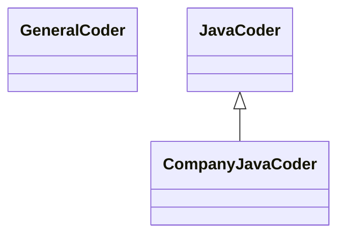

## 6.2 Skills 的结构与组成 (Anatomy of a Skill)

一个 Skill 不仅仅是一段文字，它是一个**工程化的软件包**。类似于程序员熟悉的 npm 包或 Python Wheel。
了解其内部结构，是创建自定义 Skill 的第一步。

### 6.2.1 标准文件目录结构

一个典型的 Skill 包（文件夹）结构如下：


```text
my-awesome-skill/
├── manifest.json        # 元数据：名称、版本、依赖
├── skill.md             # 核心指令 (System Prompt)
├── docs/                # 领域知识文档 (RAG Source)
│   ├── guidelines.pdf
│   └── api_specs.md
├── tools/               # 专用工具定义 (MCP)
│   ├── calculator.py
│   └── search.ts
└── examples/            # Few-shot 示例库
    ├── input_1.txt
    └── output_1.txt
```

#### `manifest.json` (身份证)
定义 Skill 的基本信息，帮助 Router 识别它。

```json
{
  "name": "enterprise-java-expert",
  "version": "1.0.0",
  "description": "Expert in Java Spring Boot development with focus on memory safety.",
  "triggers": ["java", "spring boot", "jvm", "memory leak"],
  "dependencies": ["mcp-server-git"]
}
```
*   **triggers**: 关键词或语义标签，决定何时激活此 Skill。

#### `skill.md` (大脑)
这是 Skill 的灵魂。它包含特定于该领域的 System Prompt。

```markdown
# Role
你是一位拥有 10 年经验的 Java 架构师。

# Guidelines
1. 始终使用 Java 17+ 特性。
2. 优先通过 Stream API 处理集合。
3. 如果看到 `System.out.println`，必须警告用户改用 `Slf4j`。

# Workflow
1. 分析用户需求。
2. 检查现有的类结构。
3. 编写 Interface。
4. 编写 Implementation。
```

#### `docs/` (知识库)
这里存放该领域的“教科书”。
例如，不仅是通用的 Java 知识，还可以放入**你们公司的内部编码规范 PDF**。
当 Skill 加载时，这些文档会被索引，Claude 可以随时查阅（基于 RAG 或 Long-Context）。

#### `tools/` (工具箱)
Skill 可以自带工具。
例如，一个 `Data Visualization Skill` 可能自带一个 Python 脚本，用于将 CSV 转化为复杂的 D3.js 图表。这些工具通常通过 MCP 协议暴露。

### 6.2.2 核心要素设计原则

设计 Skill 时，要遵循 **"高内聚，低耦合"** 的原则。

#### 专注单一领域
不要尝试做一个 `Everything Skill`。
*   *Bad*: "Java + C++ + HR + Cooking Expert"
*   *Good*: "Java Spring Security Expert"

#### 显性化最佳实践
将隐性的“老手经验”显性化写在 `skill.md` 中。
比如：“在 Spring 中，总是优先使用构造器注入 (Constructor Injection) 而不是字段注入 (Field Injection)。”

#### 动态示例 (Dynamic Few-Shot)
在 `examples/` 文件夹中放入高质量的 Input-Output 对。
Router 可以在运行时挑选最相关的通过 Few-Shot 喂给模型，无需每次都加载所有示例。

### 6.2.3 继承与组合

Skill 支持类似面向对象编程的**继承**关系（取决于具体实现平台，概念上通用）。



**图 1：Skill 继承关系图**
此图展示了 Skill 的层级继承概念。最底层的 `GeneralCoder` 提供基础编码能力，`JavaCoder` 在此基础上增加语言特性，而最上层的 `CompanyJavaCoder` 则进一步注入了具体的企业规范。这种继承机制允许我们复用通用的 Prompt 片段，避免重复造轮子。

*   **GeneralCoder**: 包含通用的编程原则（DRY, SOLID）。
*   **JavaCoder**: 继承通用原则，增加 Java 特有的语法规范。
*   **CompanyJavaCoder**: 继承 Java 规范，增加公司内部特定的库使用规则和 License 声明。

这种分层结构极大地提高了 Skill 的维护效率。

---

了解 Skill 的组装结构后，在实际使用中，很多时候无需重复造轮子，因为官方已经内置了许多强大的 Skills。

➡️ [使用内置 Skills](6.3_builtin.md)
