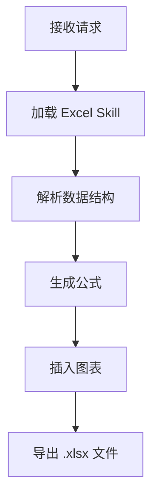

## 6.3 使用内置 Skills

Anthropic 官方提供了一系列开箱即用的 Skills，这些 Skills 经过精心调优，能够让 Claude 生成专业级的文档和文件。

### 6.3.1 官方内置 Skills 列表

截至 2025 年 12 月，Anthropic 官方提供以下核心 Skills：

| Skill | 功能 | 典型用例 |
| :--- | :--- | :--- |
| **Excel/Spreadsheets** | 生成带公式的专业电子表格 | 财务报表、数据分析、预算规划 |
| **PowerPoint** | 创建演示文稿 | 汇报材料、提案文档 |
| **Word/DOCX** | 创建和编辑 Word 文档，支持修订追踪 | 合同审阅、报告撰写 |
| **PDF** | 处理可填写的 PDF 表单 | 表单填写、文档提取 |

这些 Skills 的强大之处在于：它们不是简单地生成文本，而是**调用底层库生成真正的二进制文件**。例如，Excel Skill 使用 `openpyxl` 生成的 `.xlsx` 文件包含正确的公式引用，而非静态数值。

### 6.3.2 Skill Creator：快速创建自定义 Skill

Anthropic 还提供了一个特殊的 **skill-creator** Skill，它可以引导你交互式地创建新 Skill：

1. 启用 skill-creator 后，Claude 会询问你的工作流程细节
2. 自动生成 `SKILL.md` 文件结构
3. 格式化 frontmatter 和正文
4. 打包所需的资源文件

获取方式：
- GitHub 仓库：[anthropics/skills/skill-creator](https://github.com/anthropics/skills/tree/main/skill-creator)
- 或直接在 Claude.ai 中搜索启用

### 6.3.3 Skills 的触发方式

#### 隐式触发（推荐）

这是最自然的交互方式，无需特殊指令：

```text
用户：帮我创建一个季度销售报表的 Excel 文件，包含同比增长公式。
```

Claude 的内部流程：
1. 语义分析检测到 "Excel" + "公式"
2. 自动加载 Excel Skill
3. 使用 Skill 中的指令生成专业电子表格
4. 返回可下载的 `.xlsx` 文件

#### 显式调用

当需要强制使用特定 Skill 时，可以在请求中明确提及：

```text
用户：使用你的文档处理能力，帮我审阅这份合同并添加修订标记。
```

### 6.3.4 Skills 获取渠道

#### Claude.ai
1. 进入 **Settings → Features → Skills**
2. 启用所需的内置 Skills
3. 上传自定义 Skills（Pro/Max/Team/Enterprise 计划）

#### Claude Code
Skills 可通过插件市场安装，或手动放置：
```bash
# 全局 Skills 目录
~/.claude/skills/

# 项目级 Skills 目录（版本控制友好）
./skills/
```

#### API 开发者
通过 Skills API 管理：
```bash
# 列出可用 Skills
GET /v1/skills

# 创建新 Skill
POST /v1/skills

# 在消息中使用 Skill
POST /v1/messages
# 请求体中包含 skills 参数
```

### 6.3.5 实战演示：财务报表生成

以下演示 Excel Skill 的实际效果：

**用户输入**：
```text
根据以下数据创建一个 Q3 财务摘要 Excel：
- 营收：$2.5M（同比 +15%）
- 成本：$1.8M
- 利润率需要自动计算
- 添加同比趋势图
```

**Claude 处理流程**：



**输出结果**：
- 生成的 Excel 文件包含：
  - 正确的 `=B2-B3` 利润计算公式（非静态值）
  - 动态更新的利润率百分比
  - 内嵌的柱状图（数据区域正确引用）

这与让 Claude 直接生成文本格式的"表格"有本质区别——**代码执行保证了计算的 100% 准确性**。

### 6.3.6 Partner Skills 生态

除了官方内置 Skills，Anthropic 还与合作伙伴建立了 Skills 生态：

| 合作伙伴 | Skill 功能 |
| :--- | :--- |
| **Box** | 将 Box 中的文件转换为 PowerPoint/Excel/Word |
| **Canva** | 在 Agent 工作流中生成设计稿 |
| **Notion** | 深度集成 Notion 页面操作 |
| **Rakuten** | 财务工作流自动化 |

这些 Partner Skills 可以在 [Claude Skills Directory](https://claude.com/skills) 中浏览和启用。

---

内置 Skills 覆盖了通用场景，但企业往往有独特的业务逻辑和规范。下一节将深入讲解如何创建专属的自定义 Skill。

➡️ [创建自定义 Skills](6.4_custom.md)
