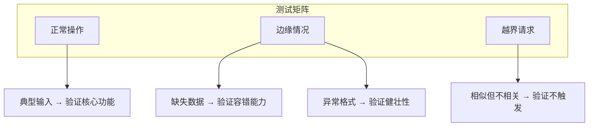

## 6.4 创建自定义 Skills

当内置 Skills 无法满足特定需求时，就是发挥创造力的时候了。本节将通过三个官方示例，深入讲解如何创建高质量的自定义 Skill。

### 6.4.1 示例一：DOCX 文档处理 Skill

这是 Anthropic 官方 Skills 仓库中的一个经典案例，展示了如何处理复杂的工作流分支。

#### SKILL.md 文件

```yaml
---
name: docx
description: "Comprehensive document creation, editing, and analysis with 
support for tracked changes, comments, formatting preservation, and text 
extraction. When Claude needs to work with professional documents (.docx 
files) for: (1) Creating new documents, (2) Modifying or editing content, 
(3) Working with tracked changes, (4) Adding comments, or any other 
document tasks"
license: Proprietary
---

# DOCX creation, editing, and analysis

## Overview
A user may ask you to create, edit, or analyze the contents of a .docx 
file. A .docx file is essentially a ZIP archive containing XML files 
and other resources that you can read or edit.

## Workflow Decision Tree

### Reading/Analyzing Content
Use "Text extraction" or "Raw XML access" sections below

### Creating New Document
Use "Creating a new Word document" workflow

### Editing Existing Document
- **Your own document + simple changes**
  Use "Basic OOXML editing" workflow
- **Someone else's document**
  Use **"Redlining workflow"** (recommended default)
- **Legal, academic, business, or government docs**
  Use **"Redlining workflow"** (required)
```

#### 设计亮点

1. **决策树结构**：根据任务类型（读取/创建/编辑）路由到不同流程
2. **渐进式披露**：主文件提供概述，详细流程放在独立的 `workflow-*.md` 文件中
3. **明确的边界**：区分了"自己的文档"和"别人的文档"应使用不同流程

### 6.4.2 示例二：品牌指南 Skill

这个示例展示了如何封装企业特有的设计规范。

```yaml
---
name: brand-guidelines
description: "Applies Anthropic's official brand colors and typography to 
any sort of artifact that may benefit from having Anthropic's look-and-feel. 
Use it when brand colors or style guidelines, visual formatting, or company 
design standards apply."
license: Complete terms in LICENSE.txt
---

# Anthropic Brand Styling

## Colors

**Main Colors:**
- Dark: `#141413` - Primary text and dark backgrounds
- Light: `#faf9f5` - Light backgrounds and text on dark
- Mid Gray: `#b0aea5` - Secondary elements

**Accent Colors:**
- Orange: `#d97757` - Primary accent
- Blue: `#6a9bcc` - Secondary accent
- Green: `#788c5d` - Tertiary accent

## Typography
- **Headings**: Poppins (with Arial fallback)
- **Body Text**: Lora (with Georgia fallback)

## Text Styling
- Headings (24pt+): Poppins font
- Body text: Lora font
- Smart color selection based on background
```

#### 设计亮点

1. **精确信息**：提供 Claude 无法内置的具体数值（十六进制颜色码、字体名称）
2. **实用主义**：不需要复杂逻辑，直接给出可执行的规范
3. **Fallback 策略**：考虑到字体可能缺失，提供了备选方案

### 6.4.3 示例三：前端设计 Skill

这个高级示例展示了如何约束创意输出。

```yaml
---
name: frontend-design
description: "Create distinctive, production-grade frontend interfaces with 
high design quality. Use this skill when the user asks to build web 
components, pages, or applications. Generates creative, polished code that 
avoids generic AI aesthetics."
license: Complete terms in LICENSE.txt
---

# Frontend Design Skill

## Design Thinking

Before coding, commit to a BOLD aesthetic direction:
- **Purpose**: What problem does this interface solve?
- **Tone**: Pick an extreme: brutally minimal, maximalist chaos, 
  retro-futuristic, organic/natural, luxury/refined, playful/toy-like...
- **Differentiation**: What makes this UNFORGETTABLE?

## Typography
Choose fonts that are beautiful, unique, and interesting. 
**AVOID**: Arial, Inter, Roboto, system fonts
**PREFER**: Distinctive display fonts paired with refined body fonts

## Color & Theme
Dominant colors with sharp accents outperform timid, evenly-distributed 
palettes. Use CSS variables for consistency.

## NEVER Use
- Overused font families (Inter, Roboto, Arial)
- Clichéd color schemes (purple gradients on white)
- Predictable layouts and component patterns
- Cookie-cutter design that lacks context-specific character
```

#### 设计亮点

1. **反面约束**：明确列出"不要做什么"，避免生成千篇一律的 AI 风格
2. **鼓励创意**：使用激励性语言（"BOLD", "UNFORGETTABLE"）引导高质量输出
3. **思考框架**：要求先思考再编码，提升输出的针对性

### 6.4.4 Description 对比：强 vs 弱

以下是影响 Skill 触发准确性的关键因素：

| 弱 Description | 强 Description |
| :--- | :--- |
| "Helps with PDFs" | "Extract tables from PDFs, merge/split documents, fill forms. Use for batch processing. Not for simple viewing." |
| "Code review skill" | "Reviews code for OWASP Top 10 vulnerabilities, enforces company style guide, outputs severity-ranked findings table." |
| "Writing helper" | "Transforms rough notes into polished blog posts following SEO best practices. Outputs markdown with frontmatter." |

**核心原则**：
- 使用**动词**描述能力（extract, merge, transform）
- 说明**触发场景**（when to use）
- 划定**边界**（not for...）

### 6.4.5 测试矩阵

创建 Skill 后，使用以下矩阵进行系统测试：



| 测试类型 | 示例 | 期望结果 |
| :--- | :--- | :--- |
| 正常操作 | 使用 docx skill 创建合同 | 生成带格式的 .docx 文件 |
| 边缘情况 | 输入只有表格没有文字的文档 | 正确处理或提示需要补充信息 |
| 越界请求 | 请求 docx skill 分析 PDF | **不应触发**，提示使用 PDF skill |

### 6.4.6 企业级部署

2025 年 12 月，Anthropic 发布了组织级 Skills 管理功能：

- **集中管理**：管理员可以统一部署、更新、撤回 Skills
- **版本控制**：通过 API 管理 Skill 版本
- **审计日志**：追踪 Skill 的使用情况

部署方式：
1. 在 [Claude Console](https://platform.claude.com) 创建组织 Skill
2. 设置访问权限（全员 / 特定团队）
3. 员工在 Claude.ai 中自动获得访问权限

---

现在已经掌握了创建单一 Skill 的能力。在实际工作中，复杂任务往往需要多个 Skills 协同工作。下一节将探讨 **Skills 的组合与编排**。

➡️ [Skills 组合与高级用法](6.5_combination.md)
