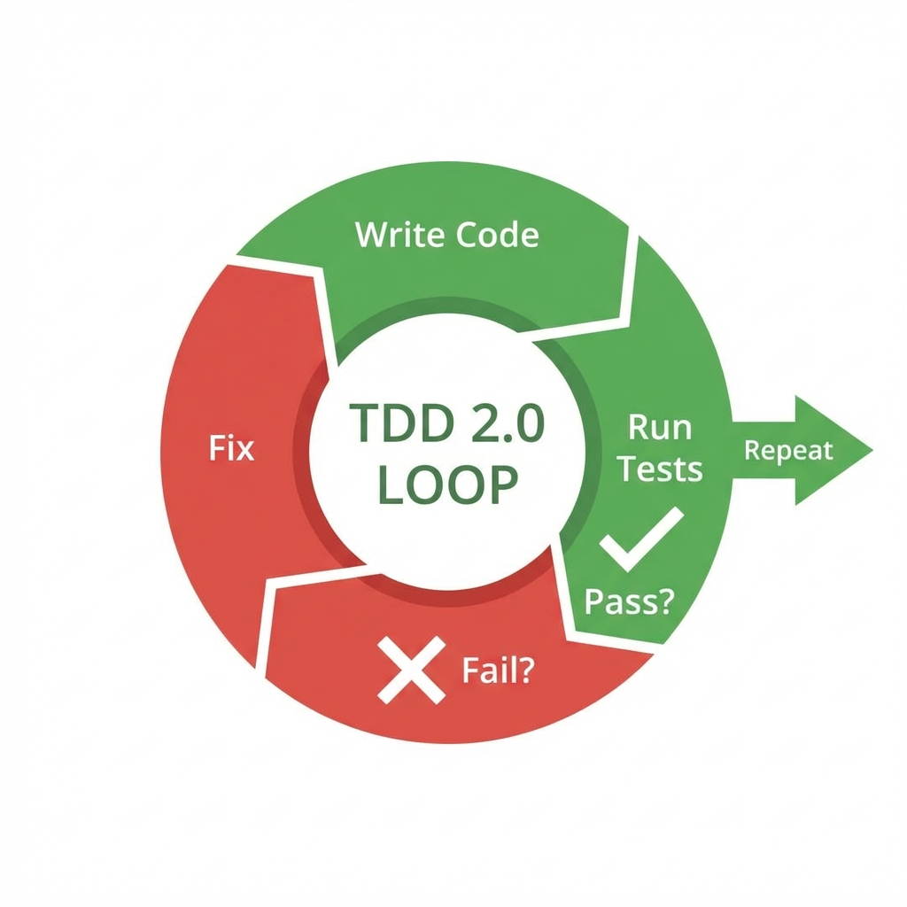

## 本章小结：从编程助手到 AI 合伙人

Agentic Coding (代理式编程) 正在从根本上改变软件工程的面貌。
本章见证了从 "Copilot"（副驾驶）到 "Agent"（自主代理）的飞跃。前者是**辅助输入**，后者是**结果交付**。

### 核心知识点回顾

#### Claude 的角色
*   **Polyglot Expert**: 通晓百种语言，无论是新潮的 Rust 还是古老的 Fortran。
*   **Context Master**: 200k Token 的记忆使其能吞下整个项目的核心逻辑，这是它能做系统级重构的关键。

#### 工具链体系
*   **Claude Code CLI**: 终端不仅是黑客的游乐场，也是 AI 发挥威力的最佳舞台。`claude` 命令赋予了 AI 接触文件系统和 shell 的权力，使其能实现 "Coding -> Testing -> Fixing" 的闭环。
*   **IDE Integration**: Cursor 和 VS Code Plugins 让 AI 上下文感知（Context Awareness）达到了前所未有的高度。

#### 工作流变革

*   **TDD 2.0**: 人写测试，AI 写实现。通过测试用例来约束 AI 的发散，这是目前最稳健的开发模式。
*   **Legacy Refactoring**: 那些谁也不敢动的“屎山”代码，现在可以放心地交给 AI 去清理、注释和升级。

#### 成功法则
*   **Context is King**: 喂给 AI 的上下文（Context）必须准确、相关。不要让它猜。
*   **Trust but Verify**: AI 是最好的员工，但不是完美的员工。Code Review 变得比以往任何时候都重要——不仅仅是检查 Bug，更是检查逻辑漏洞和安全隐患。

### 开发者自检清单

- [ ] **工具就绪**：我是否安装了 `claude-code` CLI 并配置了 `.clauderc`？
- [ ] **环境集成**：我的 IDE (VS Code/Cursor) 是否能顺畅地调用 Claude？
- [ ] **协作模式**：我是否尝试过“我写 Test，它写 Code”的 TDD 模式？
- [ ] **安全意识**：在 CLI 中使用自动模式 (`--auto`) 时，我是否清楚这一步操作的后果（尤其是 `rm`, `git push`）？

### 下一站：构建 AI 员工

我们已经掌握了“单兵作战”的技巧。现在，假设你想开一家只有 AI 员工的公司。
你需要一个 AI 做产品经理，一个 AI 做后端，一个 AI 做前端，还有一个 AI 做测试。它们需要互相沟通、互相 Review。
这就是 **Multi-Agent Systems (多智能体系统)**。

让我们进入第八章，设计真正的 **[Agent 架构](../08_agent/README.md)**。

➡️ [Agent 架构设计](../08_agent/README.md)
