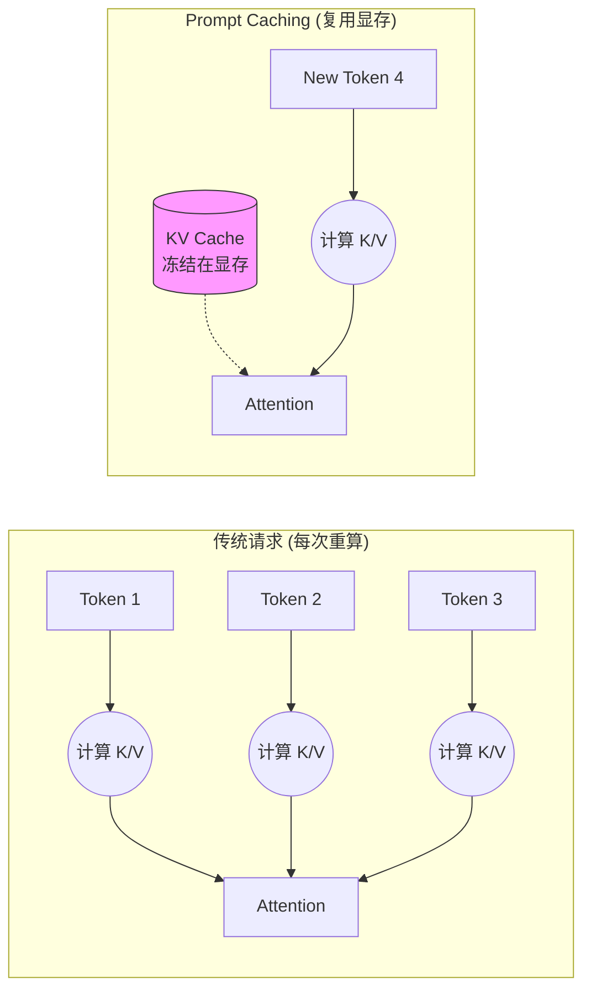

## 10.2 提示缓存

Prompt Caching 是 2024 年 LLM 架构层面最大的创新之一。
它打破了“无状态 API”的魔咒，让长上下文应用变得既**便宜**又**快速**。

### 10.2.1 什么是 Prompt Caching？

#### 通俗类比：图书馆模式

*   **没有缓存 (No Cache)**：每次你去图书馆（Claude），都让你带一整车书（Context）过去。图书管理员必须一本本读完这些书，才能回答你的问题。这既费时（Token 计算慢）又费运费（Token 计费贵）。
*   **有了缓存 (With Cache)**：你只需要第一次把车开过去，告诉管理员：“这车书先放你这儿存 5 分钟”。接下来 5 分钟内，你再来问问题，只要报个书名，管理员直接就能回答，因为书已经在架子上了。

#### 技术原理：KV Cache 重用 (Deep Dive)

要理解缓存为什么能省钱，必须深入到 **Transformer** 架构的底层。

1.  **注意力机制 (Self-Attention)**:
    LLM 在处理每一个 Token 时，都需要“回头看”之前所有的 Token，以理解上下文关系。这个“回头看”的过程，在数学上就是计算 **Attention 矩阵**。
    
    $$ Attention(Q, K, V) = \text{softmax}(\frac{QK^T}{\sqrt{d_k}})V $$
    
    其中：
    *   **Q (Query)**: 当前 Token 的查询向量（“我在找什么？”）。
    *   **K (Key)**: 历史 Token 的索引向量（“我有这个特征”）。
    *   **V (Value)**: 历史 Token 的内容向量（“这是我的具体信息”）。

2.  **Prefill (预填充) 的代价**:
    当我们发送一段 10k 字的 Prompt 给模型时，模型必须计算这 10k 个 Token 每一层的 Q、K、V 向量。这个过程被称为 **Prefill**。
    *   **计算量巨大**: 随着长度增加，计算量呈 $O(N^2)$ 或 $O(N)$ 增长（取决于实现），消耗大量的 GPU 算力。
    *   **显存占用**: 计算出的 Q, K, V 矩阵需要存放在 GPU 显存（VRAM）中。

3.  **Cache Hit (缓存命中)**:
    Prompt Caching 的核心逻辑是：**“只要前缀（Prefix）不变，K 和 V 矩阵就不变。”**
    
    *   **无缓存**: 每次请求，GPU 都要重新把 10k 字算一遍矩阵。
    *   **有缓存**: 第一次算完后，我们将这 10k 字对应的 **K 矩阵和 V 矩阵** (即 KV Cache) 直接“冻结”在显存里。
    *   **复用**: 下次请求如果前缀相同，直接把显存里的 KV Cache 拿来用，GPU 只需要从第 10,001 个 Token 开始计算。这不仅节省了算力（Write Cost），更极大地减少了内存搬运时间（Latency）。



### 10.2.2 缓存计费模型 (Savings)

Prompt Caching 的定价策略非常激进，旨在鼓励长 Context 复用。

| 状态 | 写入成本 (Write) | 读取成本 (Read) | 只有在...时发生 |
| :--- | :--- | :--- | :--- |
| **Cache Write** | $3.75 / MTok | - | 第一次请求，或缓存过期后重新写入。比普通 Input 贵 25%。 |
| **Cache Read** | - | **$0.30 / MTok** | 后续请求命中缓存。**比普通 Input 便宜 90%！** |

**划算临界点**:
由于写入比普通请求贵 25%，通过简单计算可知，你需要**至少复用 2 次**（1次写入 + 1次读取），总成本才会低于普通请求。复用次数越多，边际成本越接近 $0.30。

### 10.2.3 如何使用：代码实战

在 API 中，缓存不是自动的，你需要显式地标记**断点 (Checkpoints)**。目前 Claude 支持最多 **4 个** cache breakpoints。

#### SDK 示例 (Python)

```python
import anthropic

client = anthropic.Anthropic()

response = client.messages.create(
    model="claude-3-5-sonnet-20241022",
    max_tokens=1024,
    system=[
        {
            "type": "text", 
            "text": "你是一个资深法律顾问，熟悉以下 500 页的民法典内容...",
            "cache_control": {"type": "ephemeral"} # 🔴 标记点 1：System Prompt
        }
    ],
    messages=[
        {
            "role": "user", 
            "content": [
                {
                    "type": "text",
                    "text": "<book_content>...这里是 5万字的书籍原文...</book_content>",
                    "cache_control": {"type": "ephemeral"} # 🔴 标记点 2：长文档
                },
                {
                    "type": "text",
                    "text": "书里关于'不可抗力'是怎么定义的？" # 🟢 动态内容（不缓存）
                }
            ]
        }
    ]
)
```

**关键点**: `cache_control: {"type": "ephemeral"}` 就是告诉 Claude：“到这里为止，前面的内容帮我存起来。”

### 10.2.4 最佳实践：结构化缓存

为了最大化命中率，必须遵循 **"静态在前，动态在后"** 的原则。因为缓存是基于**前缀匹配 (Prefix Matching)** 的。

#### 推荐结构 (The Cache Sandwich)

1.  **System Prompt (Base)** `[Cache 1]`
    *   *内容*: 角色定义、Tool Definition（这是最稳定的，所有用户共用）。
2.  **Huge Context (Docs/Code)** `[Cache 2]`
    *   *内容*: RAG 检索到的文档、整个代码库文件（相对稳定）。
3.  **Conversation History (Turns)** `[Cache 3]`
    *   *内容*: 之前的多轮对话历史。
4.  **User Query** `[No Cache]`
    *   *内容*: 用户当前最新的提问（完全动态）。

#### 图解命中逻辑

```text
Request A: [System] -> [Docs] -> [History A] -> [Query A]
             |           |
             V           V
Cache:       Hit         Hit (Cache Read: $0.30)

Request B: [System] -> [Docs] -> [History B] -> [Query B]
             |           |          |
             V           V          X
Cache:       Hit         Hit       Miss (Cache Write for History B)
```

即使 Request B 的历史记录变了，但前面的 System 和 Docs 依然能命中缓存，依然能省大钱。

### 10.2.5 生命周期 (TTL) 与驱逐

**TTL (Time-To-Live)**:
*   现在的 TTL 是 **5 分钟**。
*   **自动续期**: 每次 Cache Hit，TTL 会自动重置为 5 分钟。
*   只要请求不断（比如高频对话），缓存就可以一直存活。

**驱逐策略**:
*   如果不作为，5 分钟后缓存自动删除。
*   也可以显式作为（虽然目前 API 不支持 delete，但可以通过不再引用来让其自然过期）。

### 10.2.6 适用场景 checklist

| ✅ 适合用缓存 | ❌ 不适合用缓存 |
| :--- | :--- |
| **长文档问答**: 针对同一本书问 10 个问题。 | **一次性任务**: 传一本书总结一下，然后就再也不问了。 |
| **代码助手**: 整个仓库代码作为 Context，反复修改。 | **低频客服**: 凌晨 3 点，每小时只有 1 个用户来访（TTL 会过期）。 |
| **Few-Shot**: 带 100 个 示例的 Prompt。 | **短文本**: 总共才 500 token，没必要缓存。 |
| **Agent**: 工具定义特别多、System Prompt 特别长。 | |

---

缓存解决了静态上下文的成本问题。但对于不断增长的动态对话历史，我们无法无限期地缓存下去，这就需要更高级的管理策略。

➡️ [上下文窗口管理](10.3_context_mgmt.md)
