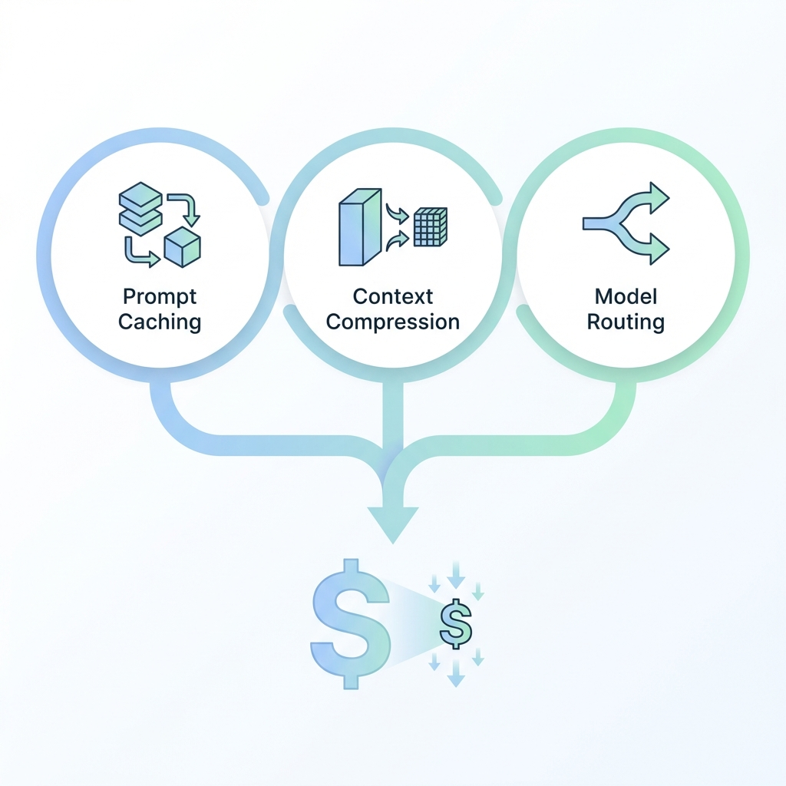

# 第十章：成本优化与性能调优

合理管理成本和优化性能是生产应用的关键。

---

## 本章重点

- Token 计费原理
- Prompt Caching 提示缓存
- 上下文窗口管理
- 模型选择与成本权衡

---

## 章节导航

| 章节 | 主题 |
|------|------|
| [10.1](10.1_pricing.md) | Token 计费原理 |
| [10.2](10.2_caching.md) | Prompt Caching 提示缓存 |
| [10.3](10.3_context_mgmt.md) | 上下文窗口管理 |
| [10.4](10.4_selection.md) | 模型选择与成本权衡 |
