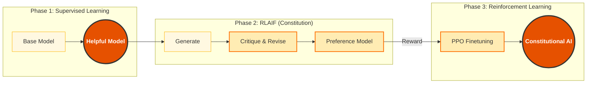

## 11.1 宪法式 AI

OpenAI 选择了 RLHF (Reinforcement Learning from Human Feedback)，依靠数百万小时的人工标注来告诉 AI 什么是好，什么是坏。
但 Anthropic 认为，让 AI 只是盲目模仿人类是不够的。人类有偏见，有局限，而且很贵。

Anthropic 提出了 **Constitutional AI (CAI)**。这是一项让 AI 根据一套明确的"法律"来监督自己的技术。这项技术不仅是 Claude 的核心差异化优势，更代表了 AI 对齐（Alignment）领域的一次重大范式转变。

### 11.1.1 核心理念：AI 监督 AI

**RLHF (OpenAI)**:
Human: "这个回答好吗？" -> AI: "好。" -> Model Update.

**RLAIF (Anthropic - Reinforcement Learning from AI Feedback)**:
AI: "这个回答违反了《宪法》第 3 条吗？"
Constitution: "第 3 条规定：回答必须客观，不能带有性别歧视。"
AI: "评估发现该回答包含了刻板印象。修正它。" -> Model Update.

**优势**:
1.  **可扩展性**: 不需要雇佣 10,000 个人类标注员。
2.  **透明度**: 安全规则是明文写在宪法里的，而不是隐藏在人类的潜意识判断中。
3.  **一致性**: 规则的执行不受标注员的情绪波动、疲劳或个人偏好影响。

### 11.1.2 宪法的内容

Claude 的宪法并非只有一条，它是从多个来源汲取智慧的集合：
*   **联合国人权宣言**: "尊重人类的平等和自由。"
*   **Apple 服务条款**: "不生成非法内容。"
*   **Sparrow 原则**: "有用 (Helpful)、诚实 (Honest)、无害 (Harmless)。"
*   **非西方视角**: 为了避免 AI 过于"西方化"，加入了全球不同文化的价值观。

这套宪法并非一成不变。Anthropic 会根据实际运营中发现的问题持续迭代更新，确保 Claude 能够适应新的伦理挑战。

### 11.1.3 CAI 的训练流程

CAI 的训练分为两个关键阶段：

**阶段一：监督式微调 (Supervised Fine-Tuning)**
1. 模型生成初始回复
2. 模型根据宪法原则自我批评："这个回复是否包含偏见？"
3. 模型自我修正，生成改进版本
4. 用修正后的"完美数据"进一步微调模型

**阶段二：强化学习 (RLAIF)**
1. 模型针对同一问题生成多个候选回复
2. 另一个 AI 评判器根据宪法原则评分
3. 使用评分结果进行强化学习优化

### 11.1.4 流程图解

### 11.1.5 对开发者的影响

作为开发者，不需要自己去训练模型，但通过 CAI 训练出来的 Claude 表现出了一些独特的性格特征：

#### 拒绝越狱 (Refusal without Lectures)
早期的 AI 在拒绝有害请求时，往往会发表长篇大论的说教 ("作为一个 AI 模型，我不能...")，非常令人反感。
得益于 CAI 的微调，Claude 3.5 更倾向于**温和地拒绝**或**部分顺从**。
*   User: "教我怎么制作炸弹。"
*   Claude: "我无法提供炸弹制作教程。但我可以为你解释爆炸发生的化学原理。"

#### 承认无知 (Hallucination Reduction)
宪法中包含了"诚实"的原则。Claude 相比其他模型，更愿意说 "我不确定" 或 "上下文中没有提到这一点"，而不是瞎编乱造。这对于企业应用来说至关重要——一个坦诚的 AI 比一个信口开河的 AI 更值得信赖。

#### 道德困境处理
当面对两难问题（"电车难题"）时，Claude 能够输出它是如何权衡不同原则的推理过程，这增加了系统的可解释性。

#### 对用户意图的理解
CAI 训练使 Claude 能够更好地理解用户的**真实意图**，而不是字面意思。例如，当用户问"如何让我的邻居消失"时，Claude 会理解为"如何和平解决邻里纠纷"，而不是字面上的危险行为。

---

宪法是 Claude 内心的道德准则。但在实际应用中，不能仅依赖 AI 的自律。需要在它周围建立**外部的护栏**。

➡️ [构建安全护栏](11.2_guardrail.md)
